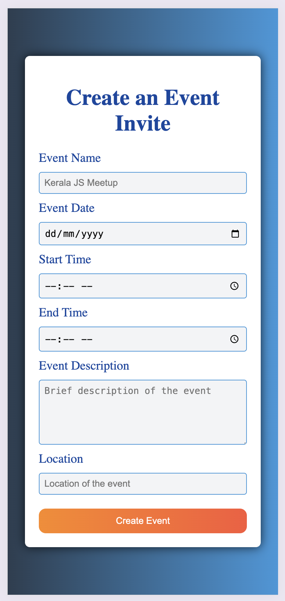
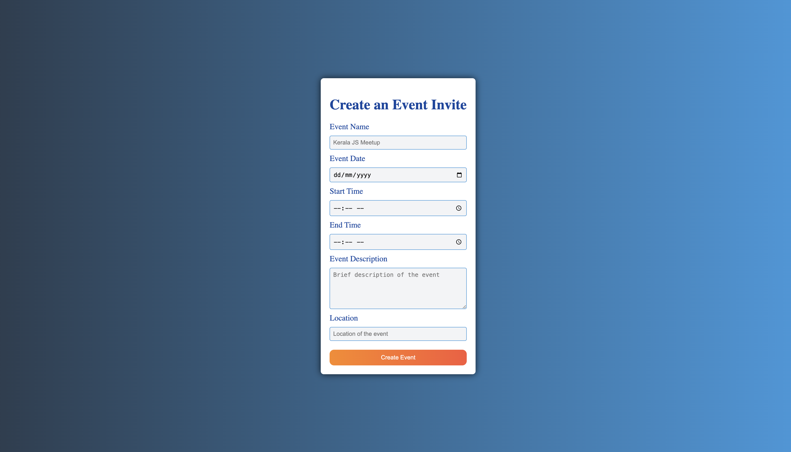

# Event Invitation Creator

## Overview

The Event Invitation Creator is a web-based application designed to help users create and manage event invitations effortlessly. This tool allows users to input event details such as the event name, date, time, location, and description, and then generates a formatted invitation that can be shared with attendees.

### Key Features
- User-Friendly Interface: Simple and intuitive interface for creating event invitations.
- Date and Time Formatting: Automatically formats dates and times to user-friendly formats.
- Validation: Ensures all required fields are filled out before generating the invitation.
- Responsive Design: The application layout is responsive and works well on different screen sizes.
- Dialog Box: Displays a dialog box for missing required fields.

## Screenshots

### mobile:

### web:

## Project Structure
1. index.html: The main HTML file that contains the structure of the project.
2. main.css: The CSS file that styles the project elements.
3. index.js: The JavaScript file that contains the project logic.

## How to Run
To run the Event Invitation Creator locally
1. Clone the repository.
2. Open index.html in a web browser.
